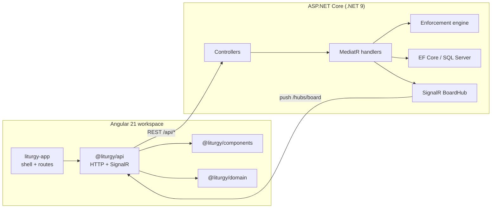

# Architecture

Liturgy is a full-stack application whose defining feature is a **server-authoritative enforcement engine**. This document describes the layers, the enforcement flow, and how state reaches collaborators in real time. For the scope and build sequence, see the [implementation plan](implementation-plan.md); for decisions and their rationale, see [DECISIONS.md](DECISIONS.md).

## System overview

## Backend layers

The backend follows Clean Architecture. The dependency direction is inward only: `Api → Application → Domain`, with `Infrastructure` implementing abstractions declared in `Application`. Nothing in `Domain` or `Application` references EF Core, ASP.NET, or SignalR.

### Domain (`Liturgy.Domain`)

The model of the Playbook. A `Workspace` (the "Account") contains `Project`s; each project holds four `Phase`s (`PhaseKind`: Discover, Discern, Develop, Demonstrate) separated by `Gate`s (`GateState`). A gate carries `Requirement`s (`RequirementState`) that must be complete before it opens. The Develop phase holds a `Sprint` and a board of `Card`s (the "tickets"; `BoardColumn`), and each card runs five `RMovement`s (`RKind`: Request, Receive, Review, Render, Rejoice; `MovementState`). Projects and cards also carry a lifecycle `Status` — a `Project` is `Active` or `Closed` (`ProjectStatus`) and a `Card` is `Open`, `Closed`, or `Cancelled` (`CardStatus`); Closed/Cancelled items are soft-hidden from their default list or board, distinct from a hard delete. `User` and `Membership` model identity and access, and an `Invitation` (`InvitationStatus`) lets a Lead grow the account by inviting people by email via an in-app token.

### Application (`Liturgy.Application`)

Use cases as MediatR commands and queries, each with its own handler, DTO, and validators. The **`EnforcementEngine`** is the heart of the layer: it decides whether a phase may advance, whether a gate may open, and whether a card may be marked Done, raising typed exceptions (`GateLockedException`, `MovementsIncompleteException`, and similar) when a transition is not allowed. Cross-cutting validation runs through a `ValidationBehavior` pipeline. The layer depends only on abstractions — `IAppDbContext`, `IClock`, `ICurrentUser`, `IJwtTokenIssuer`, `IPasswordHasher`, and `IRealtimeNotifier`.

### Infrastructure (`Liturgy.Infrastructure`)

Concrete implementations: `AppDbContext` (EF Core, SQL Server) with the initial migration, `JwtTokenIssuer`, `BCryptPasswordHasher`, `HttpContextCurrentUser`, `SystemClock`, the `SignalRRealtimeNotifier` and its `BoardHub`, and the `DevDataSeeder` that creates the "Lantern" demo in Development.

### Api (`Liturgy.Api`)

Thin controllers — `Auth`, `Me`, `Projects`, `Board`, `Gates`, `Loop` — that translate HTTP into MediatR messages. `ExceptionHandlingMiddleware` maps domain and application exceptions to problem responses (for example, a locked gate becomes a `409 Conflict`). `Program.cs` composes the layers, configures JWT and CORS, applies migrations, seeds demo data in Development, and maps the hub at `/hubs/board`.

## Enforcement flow

The rule that makes Liturgy *Liturgy* is that a client can never bypass process. A representative transition — logging the final movement on a card:

1. The client calls `POST /api/loop/... ` through `@liturgy/api`.
2. The controller dispatches a `LogMovementCommand`; `ValidationBehavior` checks the request shape.
3. The handler loads the card and asks the `EnforcementEngine` whether the movement is valid in the current state. An out-of-order or duplicate movement is rejected with a typed exception.
4. On success the change is persisted through `IAppDbContext`.
5. The handler notifies collaborators through `IRealtimeNotifier`; `SignalRRealtimeNotifier` pushes the updated card to everyone subscribed to that board over `/hubs/board`.
6. `MarkCardDoneCommand` consults the same engine, which refuses Done until all five movements are logged — the same rule the UI shows as a locked affordance.

Because every guard lives on the server, the locked states in the UI are a reflection of server truth, not an independent client check.

## Frontend

An Angular workspace with one application and three libraries:

- **`liturgy-app`** — the application shell, routes, and composition (provides `API_BASE_URL`).
- **`@liturgy/api`** — typed HTTP services and the SignalR board client.
- **`@liturgy/components`** — reusable UI building blocks.
- **`@liturgy/domain`** — shared types mirroring the server DTOs.

The API origin is injected through the `API_BASE_URL` token so library code never hard-codes a hostname. Real-time updates from `/hubs/board` are merged into the board and loop views so concurrent editors stay in sync.

## Testing strategy

- **`Liturgy.UnitTests`** — the enforcement engine and domain rules in isolation.
- **`Liturgy.IntegrationTests`** — full API behavior over a real SQL Server database via `WebApplicationFactory`.
- **Frontend Jest** — component and service unit tests.
- **Playwright** — end-to-end journeys against a faked backend, so they run without the API or a database.
